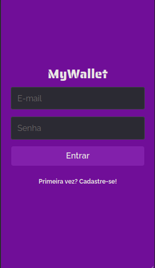
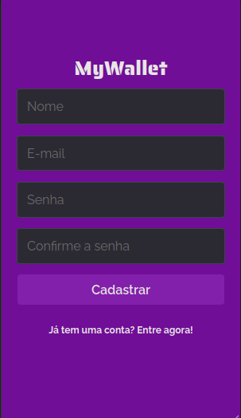
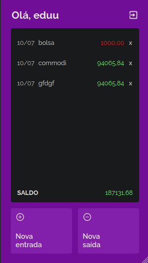
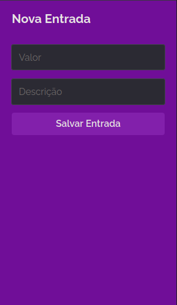
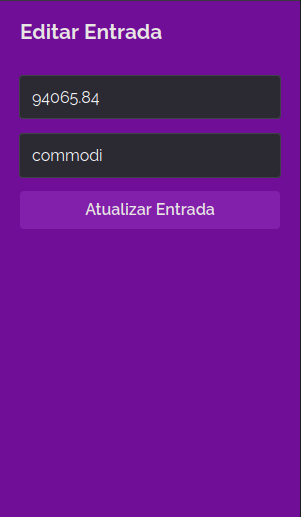

# projeto14-mywallet-front

O projeto14-mywallet-front é um aplicativo web desenvolvido para fornecer controle e gerenciamento de transações financeiras. Com ele, os usuários podem realizar login, cadastrar-se, visualizar suas transações, adicionar novas transações e editar as transações existentes de forma fácil e intuitiva.

## Sobre

O projeto14-mywallet-front é um aplicativo que oferece uma solução prática para o controle das finanças pessoais. Com ele, os usuários podem registrar suas transações de entrada e saída de dinheiro, inserindo informações como valor e descrição. Além disso, o aplicativo calcula automaticamente o saldo atual com base nas transações registradas, proporcionando uma visão clara da situação financeira.

## Tecnologias 🚀

Esse projeto foi desenvolvido com as seguintes tecnologias:

- [axios](https://axios-http.com/) 
- [react](https://react.dev/)
- [javascript](https://www.javascript.com/) 

## Rotas 🛣️

### Rotas de Autenticação 🔑

#### Rota: /
-  Esta rota corresponde à página de login. Quando o usuário acessa a raiz do aplicativo, ele é redirecionado para esta rota.

  

#### Rota: /cadastro

- Esta rota corresponde à página de cadastro. Quando o usuário acessa esta rota, ele pode criar uma nova conta no aplicativo.

  

### Rotas de Transação 💸

#### Rota: /home

- Esta rota corresponde à página inicial do aplicativo. Quando o usuário faz login com sucesso, ele é redirecionado para esta rota, onde pode visualizar suas transações e realizar outras ações.

  

#### Rota: /nova-transacao/:type

Esta rota corresponde à página de adição de uma nova transação. O parâmetro `:type` indica o tipo da transação, que pode ser "entrada" ou "saída". Por exemplo, ao acessar "/nova-transacao/entrada", o usuário pode adicionar uma nova transação de entrada.

  

#### Rota: /editar-registro/:type/:id

- Esta rota corresponde à página de edição de uma transação existente. O parâmetro `:type` indica o tipo da transação, que pode ser "entrada" ou "saída", e o parâmetro `:id` indica o ID da transação a ser editada. Por exemplo, ao acessar "/editar-registro/entrada/123", o usuário pode editar uma transação de entrada com o ID 123.

  

### Componente App

- Além das rotas, o componente App também envolve todas as páginas com o contexto de autenticação fornecido pelo AuthContextProvider, que gerencia o estado de autenticação do usuário.

